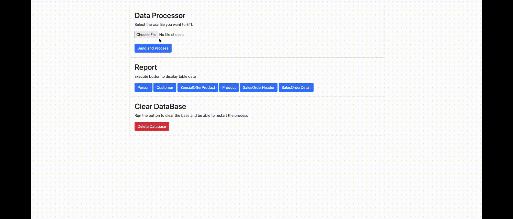

# ETL API made in python

## Summary
This API was developed with educational criteria.
Basically it is an api that contains essentially 3 routines
- Read and process a csv file and write to the database
- Generate a report of the imported data
- Erase the data if you want to re-import

## Database
The api has a connection class and database access functions, the database used was a mysql database, this class has the routines:
  - Database generation, a routine that generates the structure of the database based on the spreadsheets that follow in the example folders, that is, the database was previously developed with the spreadsheets in mind
```python
def Create():
```
  - Generic recording and reading routine
```python
def Set(command, _conn=None):
def Get(command, _conn=None):
```
  - Connection function to be reused in functions that have list routines
```python
def GetConnector():
```
  - Block function (deprecated)
```python
def SetBlock(_list, _conn=None):
```

## Report
Basically the API builds a simple report in html based on a simple sql script

## Processing
The Processing Routine basically when reading the data puts them in a class that analyzes the data according to the pre-understanding of the table fields. The recording is done in blocks, where they are defined according to the table type, these insertion blocks only record and do not duplicate or change the data, that is why there is a data deletion button, since it is a routine simple

## Demo


## Using Local
With docker you can launch the project on your local machine.
Just run the following command inside the project:
```sh
docker compose up
```